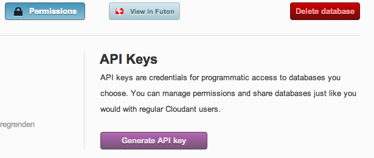
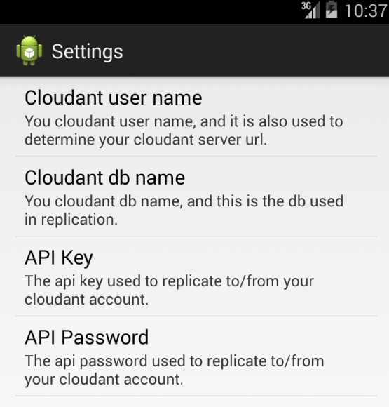
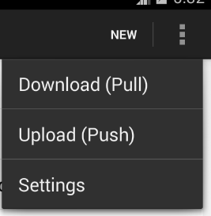
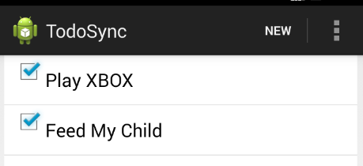
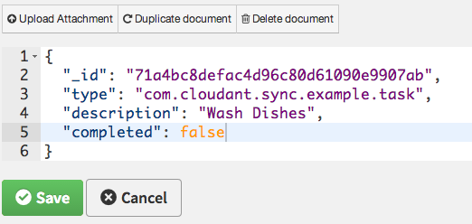
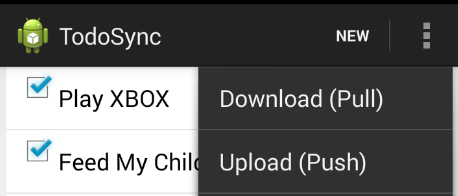
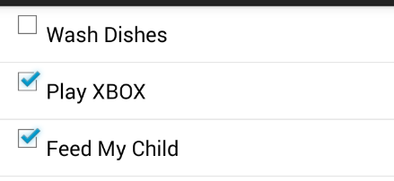

# Cloudant Sync - Android Quickstart

## Setup
First off, download [Android Studio][studio]. You'll use this as your IDE and build manager.

[studio]: http://developer.android.com/sdk/installing/studio.html

Although Android Studio comes bundled with a version of Android and the build tool [Gradle](gradle), the Cloudant EAP demo requires Gradle version 1.8 or higher and an Android SDK version greater than Rev. 19. In the following example we will be demonstrating how to setup on Mac OS X.

[gradle]: http://www.gradle.org/

We'll use [homebrew](http://brew.sh/) to install both. From the terminal:

```bash
# install homebrew
$ ruby -e "$(curl -fsSL https://raw.github.com/mxcl/homebrew/go/install)"

# install gradle and android
$ brew install gradle android
```

[brew]: http://brew.sh/

You'll need [git][git] to download the sample app. For OS X, we suggest installing via `brew install git`, then following Github's [excellent setup instructions][ghsetup].

[git]: http://git-scm.com/
[ghsetup]: https://help.github.com/articles/set-up-git

Now we'll clone the demo app. Wherever you put Android code on your computer, go there, and do this:

```bash
$ git clone https://github.com/cloudant/sync-android.git
$ cd sync-android
```

We've now downloaded the demo app, which contains the demo code.
Next up, we'll install some Android SDK build tools. Still in the terminal, run:

```bash
$ android
```

This will open up a dialog listing different versions of Android and its associated build tools. Under "Tools", check "Android SDK Build-tools" with Rev. 19. Click install packages, read and accept the license, and install. Once that's done, head to the next section.

## Building the App

Open up Android Studio. If this is your first time opening it, it will prompt you with some "Quick Start" options.

Click "Import Project..." and navigate to wherever you cloned the `cloudant-sync-eap` project. Once there, navigate to /sample/todo-sync/, select build.gradle and click OK.

A dialog will ask how to build the project. Select "Use local gradle distribution". For the _Gradle home_ option enter:

```
/usr/local/Cellar/gradle/1.8/libexec
```

That's where brew installed Gradle 1.8. Now, click OK. Setting up the project, downloading the dependencies and building the app may take a few minutes, so feel free to stand up, stretch your legs, high five someone nearby, etc. Then, go to the next section.

**Note**: If you previously installed a version of the Android Studio, it may be pointing to a different location other than `/usr/local/Cellar/`.  To allow for the build to reference the proper SDK, it is recommended that you create a `local.properties` file in the `cloudant-sync-eap/sample/todo-sync` directory that references a compatible SDK location, for example:
`sdk.dir=/usr/local/Cellar/android-sdk/22.2.1/`.

## Configuring the App
The sample app requires you to have a Cloudant account and a database for the app to sync with. To get those, go to [Cloudant's website](https://cloudant.com) and either sign up or sign in.

Then, in your dashboard, create a database in your Cloudant account for the app to synchronise with. It's best-practice to use API keys for device access rather than your Cloudant credentials, so when the database is created, open the database and use the Permissions tab to create an API key with `read` and `write` permissions.



The next step is to configure the demo app with your connection settings using the generated API key and password. The recommended approach is to edit `sync-android/sample/todo-sync/res/values/settings.xml` in your checkout:

```xml
<?xml version="1.0" encoding="utf-8"?>
<resources>
    <string name="default_user">cloudant_account_name</string>
    <string name="default_dbname">example_app_todo</string>
    <string name="default_api_key">apikey</string>
    <string name="default_api_password">secretpassword</string>
</resources>
```

On loading, [setDefaultValues][sdf] is used to load these settings. They are only loaded the first time the app is run after its installed. Therefore, if they are incorrect you either need to:

[sdf]: http://developer.android.com/reference/android/preference/PreferenceManager.html#setDefaultValues(android.content.Context,%20int,%20boolean)

* change them from within the app, shown below, or;
* delete and re-install the app to cause them to be reread from the XML file.

To change these settings in the app:



As noted above, changing the settings in the app will overwrite the defaults set in XML.

## Running the App
In Android Studio's toolbar, click the big green play-looking button. This will try to run the app.

If the IDE can't determine which device to use for the app, it will ask. Select a physical device connected to your computer or one virtualized using the Android Emulator. Once you select a device, click the big green play-looking button again.

Finally, look at your device. Is that a todo app you see there? If so, hooray! You got the Android app to run. If not, [let us know](mailto:cloudant-sync@googlegroups.com) and we'll help out.

## Using the App

Once you are in the application you can create tasks by clicking 'New', or try out the sync functionality by pushing or pulling the data from the application.



Click 'New' to create a task by entering a description.  Once a task is completed, mark it complete by clicking its check box.  At this stage, all changes made will be local to the device: you need to "push" the data to your Cloudant database to put it online, where it's discoverable by other devices with the right credentials.



Once you've replicated to the Cloudant database, log into your Cloudant account and check the todos have appeared as documents there. Try out pull replication by creating a new document in the sample app database:



Then go back into the app and click "Download (Pull)" to replicate the new task down to the app:



Sync in action!



For more in-depth information about the Sync Library please read this. Enjoy!

## Problems

**Problem**:  Android Studio reports a missing dependency, or that it can't find a required jar file.

**Answer**:  First try calling gradle from the command like with the `--refresh-dependencies` option, `gradle build --refresh-dependencies` (see section 50.9.2.2 [here][gradledeps]).

[gradledeps]: http://www.gradle.org/docs/current/userguide/dependency_management.html

Gradle uses the local maven repository to store downloaded jars (just like maven), stored at `~/.m2` by default.  If refreshing the dependencies doesn't work, often problems with missing jars can be fixed by deleting this folder, or the folders within for problematic dependencies, forcing Gradle to re-download all dependencies.
